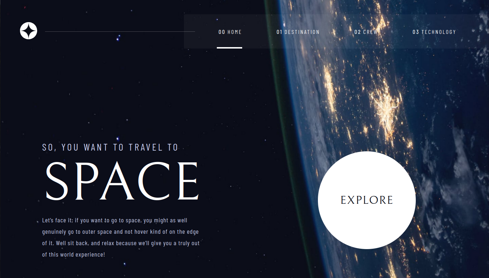

# Frontend Mentor - Space tourism website solution

This is a solution to the [Space tourism website challenge on Frontend Mentor](https://www.frontendmentor.io/challenges/space-tourism-multipage-website-gRWj1URZ3). Frontend Mentor challenges help you improve your coding skills by building realistic projects. 

## Table of contents

- [Overview](#overview)
  - [The challenge](#the-challenge)
  - [Screenshot](#screenshot)
  - [Links](#links)
- [My process](#my-process)
  - [Built with](#built-with)
  - [What I learned](#what-i-learned)
  - [Continued development](#continued-development)
  - [Useful resources](#useful-resources)
- [Author](#author)
- [Acknowledgments](#acknowledgments)

## Overview

### The challenge

Users should be able to:

- View the optimal layout for each of the website's pages depending on their device's screen size
- See hover states for all interactive elements on the page
- View each page and be able to toggle between the tabs to see new information

### Screenshot

### Links

- Solution URL: [https://github.com/rochelin-shikamaru/Space-tourism-website](https://your-solution-url.com)
- Live Site URL: [https://space-tourism-info.netlify.app/](https://your-live-site-url.com)

## My process

### Built with

- HTML5
- SASS
- JAVASCRIPT

### What I learned
I've learned responsive, I've learned how to sturcture its code with sass

## Author

- Website - [https://space-tourism-info.netlify.app](https://www.your-site.com)
- Frontend Mentor - [@rochelin-shikamaru](https://www.frontendmentor.io/profile/rochelin-shikamaru)

